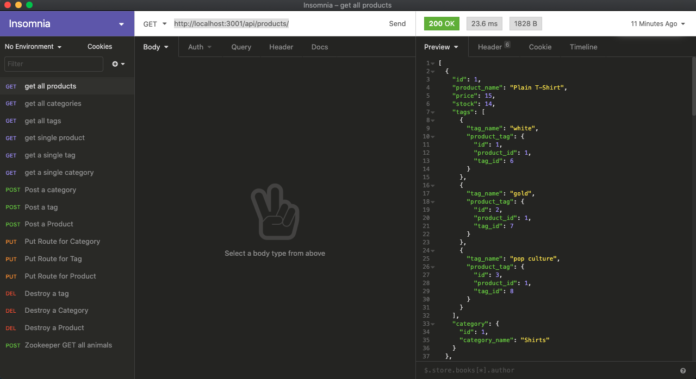

# e-commerce

## Description

The Project of the week was to write back end code for an e-commerce website. The main goal was to write models for a product, category, tag and product tag. Then to write all the CRUD method routes. After writing all the routes and models we were then tasked to link our server.js.

## Table of Contents

* [Installation](#installation)
* [Usage](#usage)
* [License](#license)
* [Contributing](#contributing)
* [Video](#video)
* [Questions](#questions)

## Installation 

Run 'npm install' in the command line to install all the necessary dependencies.

## Usage

First you must open the MySQL terminal via "mysql -u root -p" then run "source db/schema.sql" and "SHOW DATABASES" to confirm that the database was created as "ecommerce_db". Then once the database has been created simply run "npm run seed" to populate the database. 

Navigate to the insomnia app and input "http://localhost:3001/api/products/" for example, or any other routes written in the routes directory. Depending on the need you will be able to search a category by its ID, a product by its product_id and a tag by its ID. Simply change the route method to Get, Put, Post, or Delete to change the DataBase.

## Licenses

* MIT

## Contributing

* Aaron Centeno

## Technologies Used
* Express
* Node Modules
* GitHub
* JavaScript
* Terminal
* MySQL
* Sequelize

## Screenshots

## Video

https://drive.google.com/file/d/1sEcqussApXk41oi4rdjyODBk1mkN4aD8/view

## Questions

Contact Information for questions: 

GitHub: [aaroncenteno](https://www.github.com/aaroncenteno) 

E-mail: asamcent@gmail.com